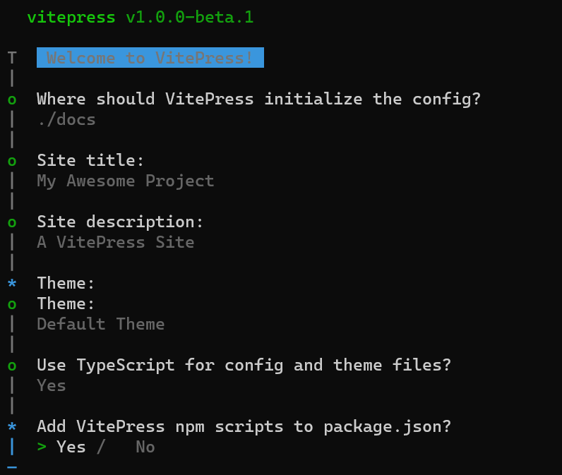

# 关于使用vitepress搭建的博客

## More

官网地址-[vitepresss](https://vitepress.dev/).

## 开始吧
这里我就参照官网的步骤

### 1
```md
pnpm add -D vitepress
```

### 2
```md
pnpm exec vitepress init
```

### 3


### 4
### 5
### 6
### 7
### 8
### 9
### 10

<script>
    11111
</script>